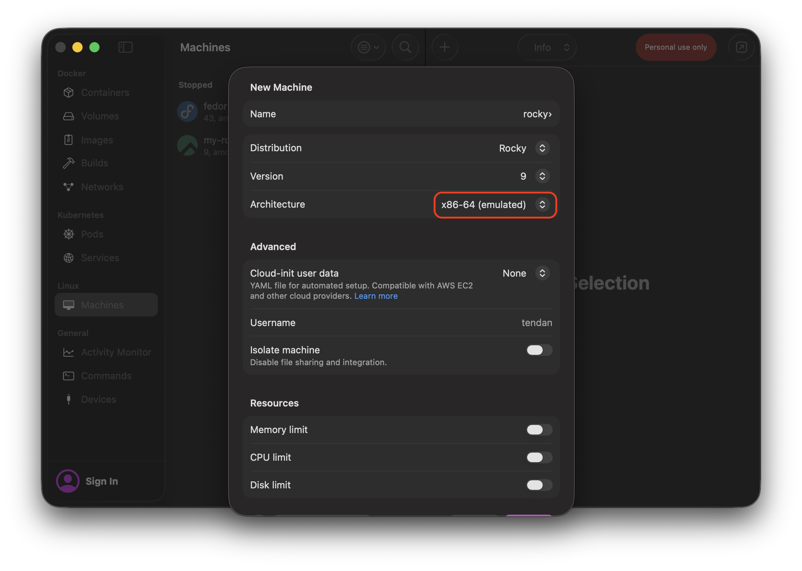
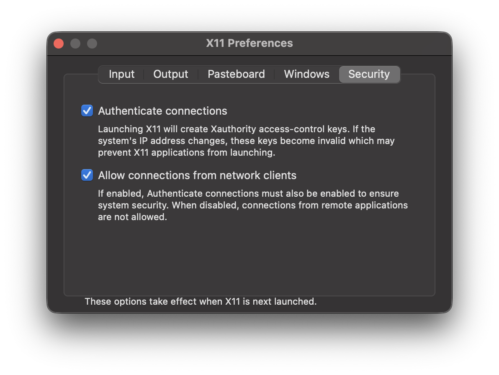
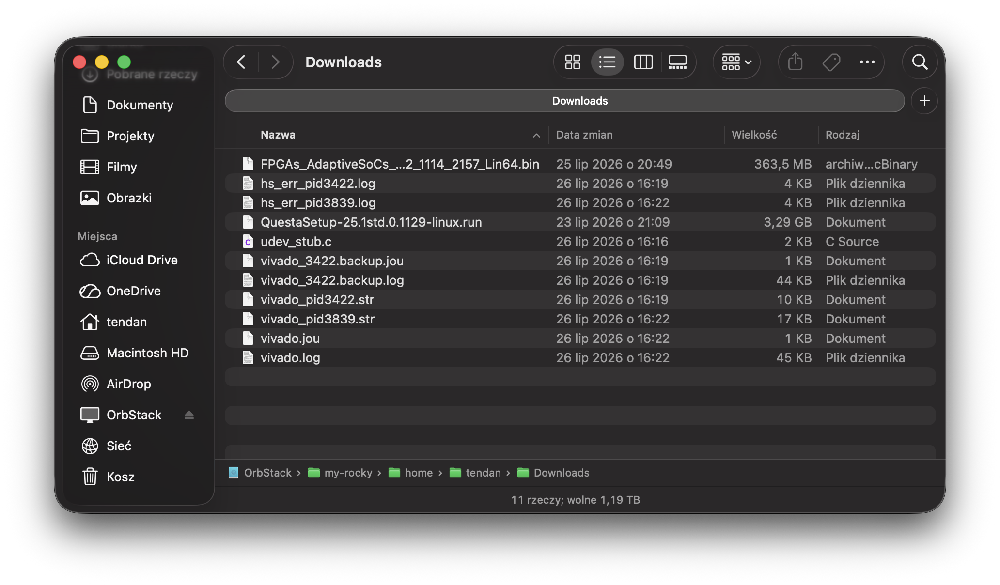
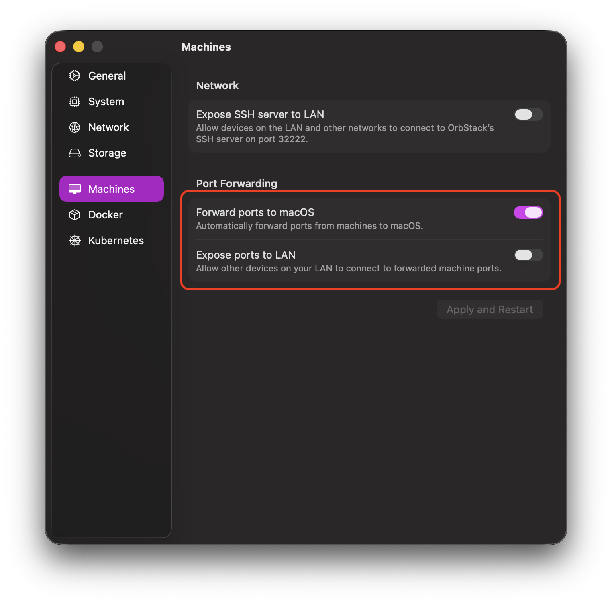

+++
title = 'Setup QuestaSim and Vivado 2025.2 on macOS'
date = 2026-08-19T20:56:41+02:00
draft = true
tags = ["questasim", "vivado", "macos", "apple", "amd", "siemens", "altera", "orbstack", "enterprise-linux"]
+++

1. Setting up the environment for EDA tools on macOS

You need to install OrbStack, which is currently the best way to use virtual Linux machines.
I personally recommend choosing a distribution from the RHEL family, as they provide the highest compatibility with (legacy) tools for ASIC/FPGA work. My choice fell on Rocky Linux.
You must choose the x86_64 architecture, as every program in this technical field is written with this architecture in mind. OrbStack uses hardware Rosetta for emulation, so the performance boost will be significant compared to Docker containers.



Dependencies that are needed:

```sh
# Rocky VM
$ sudo dnf install -y epel-release
$ sudo dnf install -y openssh-server xorg-x11-xauth xclock libX11 libXrender libXtst libXi make gcc tar gzip
```
(```openssh-server``` may seem surprising, but the explanation will appear below)

2. Installing and initial configuration of XQuartz

XQuartz is the best way to launch windows using the X11 protocol from e.g. remote connections.

The simplest step in this guide, we download XQuartz from e.g. Homebrew:

```sh
# macOS
$ brew install --cask xquartz
```

In its options, you need to enable the following:



3. Downloading QuestaSim and Vivado Design Suite installers from Altera and AMD websites

For hobbyist use, I use Questa FPGA Starter Edition (hence the installer for this version will be visible in the guide) and Vivado in not the latest version - 2025.2 ([reason here](https://www.reddit.com/r/FPGA/comments/1thstyc/vivado_20261_basic_limited_debugging_xsim/?show=original)) tl;dr AMD decided that the free version will be more cut down than before - originally they even planned not to release it for Linux.

No need to explain too much here, so I'll tell an anecdote. Getting a license, since Altera fully adopted the SSLC system, is easier than a year ago. I remember having to wait a month for Intel to let me create an account - unfortunately, I asked for it before Christmas. Then it turned out that 2FA creation was necessary - fortunately, this only required 15 minutes of email consultation with no-reply.

*IMPORTANT*: On the Altera SSLC website, you must provide the MAC ADDRESS VISIBLE in the OrbStack VM during registration:

```sh
# Rocky VM
$ ip link
...
2: eth0@if8: [...]
    link/ether xx:xx:xx:xx:xx:xx <----- this should be your MAC address to provide on the Altera website
```

The rest looks like obtaining the .dat license file from the Altera website. [https://www.youtube.com/watch?v=s9sJEv9YApY](https://www.youtube.com/watch?v=s9sJEv9YApY)

Uploading files to OrbStack machines is ridiculously simple. OrbStack attaches a network drive with file systems for each machine, which we can access from Finder (which is not so obvious).



Access to the file system of each created machine is possible even when they are turned off. Only turning off OrbStack deprives us of the ability to browse conveniently.

4. SSH server configuration

OrbStack provides a built-in SSH server for connecting to the VM at the macOS level. The problem is that it does not support ```X11Forwarding```. Hence the need to start the ```openssh-server``` downloaded earlier:

```sh
$ systemctl start sshd
```

It is worth disabling the forwarding of local networks of VMs outside our Mac in OrbStack:



You must set a password for your user using:
```sh
# Rocky VM
$ sudo passwd
```

After these steps, you should be able to connect to the VM as follows:
```sh
# macOS
$ ssh -i ~/.orbstack/ssh/id_ed25519 -Y <user>@<machine_name>.orb.local
```
```user``` is the username you created on the VM, and ```machine_name``` is the VM name given in OrbStack.

5. Installing QuestaSim

The QuestaSim graphical installer uses CPU instructions that are not translated by Rosetta, hence we get this error:
```Illegal instruction```
(sorry, we don't get anything else)

We can install without GUI (probably the best option, although the wall of text for the license, which you have to click through with Enter, may discourage you) by typing:
```sh
# Rocky VM
$ ./<questa_installer> --mode text
```

or at all costs run the Qt installer. To do this, you need to disable Rosetta during the Questa installation:
```sh
# macOS
$ orb config set rosetta false
$ orb stop
$ orb start
```

I used the second option and know that it definitely works. After installation, you can restore Rosetta.

QuestaSim must be run with the ```SALT_LICENSE_SERVER``` parameter, if you have a file, provide the absolute path to it.

Example command line launching Questa:
```sh
# Rocky VM
$ SALT_LICENSE_SERVER=/home/tendan/LR-178485_License.dat ~/altera/25.1std/questa_fse/bin/vsim -gui
```

(insert Questa screenshot here)

6. Installing Vivado

There's no great philosophy here, we run the Vivado installer (I always choose Vitis), I didn't install Xilinx USB Cable Drivers (TBA if it works through OrbStack).
*ATTENTION!* The installer on the splash screen may flicker violently, and itself is mostly white colors. After moving to the actual installation, everything returns to normal.

7. Fixing Vivado

It would be too beautiful if Vivado worked flawlessly right after installation, right? The first thing that will catch your attention will most likely be the interface, which lags mercilessly.

In this situation, you need to create an SSH session for Vivado with the following parameters:

```sh
$ ssh [[..]] -C <user>@<vm-name>.orb.local
```
```[[..]]``` simply means the rest of the parameters that are usually used (including e.g. ```-Y```).

In the VM shell configuration file (most likely .bashrc), you need to add:
```sh
export _JAVA_OPTIONS="-Dsun.java2d.xrender=false"
```
or provide it every time Vivado is launched.

The next problem you will face is trying to run synthesis or worse, implementation. Both of these things end with Vivado crashing, although here's a curiosity - for small projects (like e.g. demo multiplexer) there is a good chance that synthesis will succeed before the program crashes. I wouldn't count on the implementation result in such circumstances.

I would like to thank the author of this [project](https://github.com/filmil/vivado-docker) on GitHub for preparing udev_stub.c, which needs to be compiled and thrown into the directory that will be seen by Vivado:
```sh
# Rocky VM
gcc udev_stub.c -shared -fPIC -o udev_stub.so
sudo mv udev_stub.so /opt/udev_stub.so
```

Unfortunately, Vivado is so demanding that it won't just accept any library. You must provide names that it knows well. Hence we replace its reference for libudev without touching system libraries:
```sh
# Rocky VM
$ mkdir -p ~/fakelib
$ cp /opt/udev_stub.so ~/fakelib/libudev.so.1
$ ln -sf libudev.so.1 ~/fakelib/libudev.so
export LD_LIBRARY_PATH=~/fakelib:$LD_LIBRARY_PATH
```

(insert Vivado screenshot here)

8. Using Automator for Launchpad icons for Questa and Vivado

At the very end, I left a bonus in the form of launching both programs from macOS. The only condition is of course the OrbStack virtual machine running.

In Automator, you need to create a new Application. Both apps simply run a shell script.

For Questa:
```zsh
# Questa.app
open -a XQuartz

if [ -z "$DISPLAY" ]; then
    export DISPLAY=$(ls -t /private/tmp/com.apple.launchd/*/org.xquartz:0 2>/dev/null | head -n 1)
fi

/usr/bin/ssh -i ~/.orbstack/ssh/id_ed25519 -Y <user>@<vm_name>.orb.local "SALT_LICENSE_SERVER=<path_to_license_file.dat> <path_to_vsim> -gui"
```

For Vivado:
```zsh
# Vivado.app
open -a XQuartz

if [ -z "$DISPLAY" ]; then
    export DISPLAY=$(ls -t /private/tmp/com.apple.launchd/*/org.xquartz:0 2>/dev/null | head -n 1)
fi

/usr/bin/ssh -i ~/.orbstack/ssh/id_ed25519 -Y -C <user>@<vm_name>.orb.local "export LD_LIBRARY_PATH=~/fakelib:$LD_LIBRARY_PATH ; export _JAVA_OPTIONS=\"-Dsun.java2d.xrender=false\" ; source <path_to_settings64.sh> && <path_to_vivado>"
```

To complete the whole thing, you can add icons for the apps created in this way. Just go to "Get Info" for a specific one, click on its icon (by default the Automator robot), and paste the target one, copied earlier from the clipboard.
